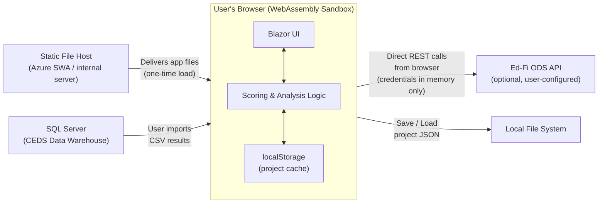
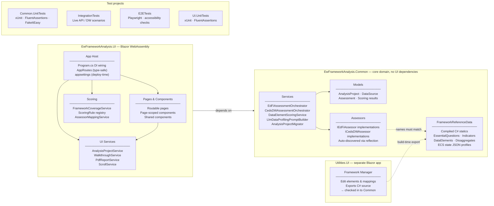
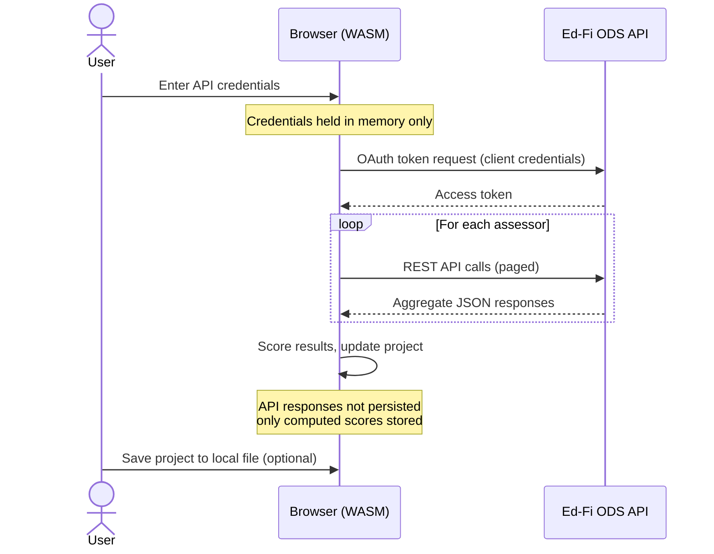
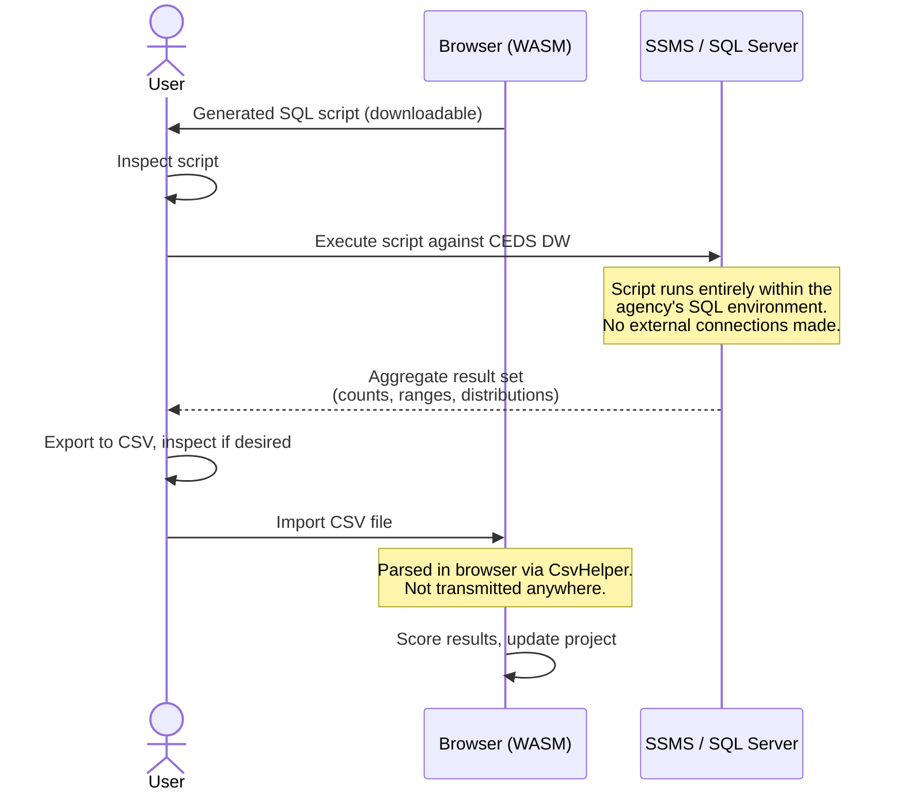
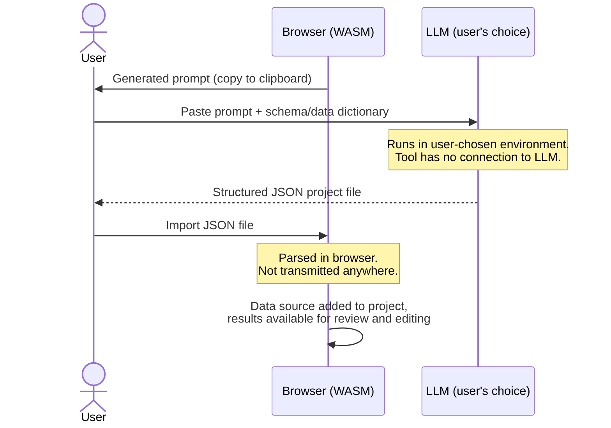

# Technical Overview

**E-W Framework Analysis Tool** _Intended audience: IT security reviewers, agency approval staff, and technical
stakeholders_

---

## Overview

The E-W Framework Analysis Tool is a **client-side web application** built with Blazor WebAssembly (.NET 10). It helps
education agencies assess their data readiness against the
[Education-to-Workforce Indicator Framework](https://educationtoworkforce.org). The application is open source and
available on GitHub.

The core architectural principle is that **all processing occurs in the user's browser**. There is no application
server, no database, and no telemetry pipeline. The tool can be hosted as a static site — including on an agency's own
internal infrastructure — and it will function identically regardless of where it is hosted.

---

## Application Architecture

The application is delivered as a set of static files (HTML, CSS, JavaScript, and compiled .NET WebAssembly). When a
user visits the application URL, these files are downloaded and the .NET runtime executes entirely within the browser's
WebAssembly sandbox.

### Codebase Structure

The solution is organized into two main projects — `Common` and `UI` — plus test projects and a separate maintenance
utility. The key architectural constraint is that `Common` has no UI dependencies; all browser-specific concerns live in
`UI`.

> **Note on FrameworkReferenceData:** The data element dictionary, indicator mappings, essential question definitions,
> and disaggregates are compiled directly into the application as C# static classes. The Framework Manager utility
> (`Utilities.UI`) is used by maintainers to edit these mappings and export them as ready-to-compile C# source, which is
> then checked in and compiled into `Common`. This is a build-time workflow, not a runtime dependency.

---

## Data Flows

### 1. Project Data (Always)

A user's work in the tool — their list of data sources, assessment results, and scores — is stored as a **project**.

- The project is cached in **browser `localStorage`** automatically so work is not lost on navigation.
- The user may **save the project to a local JSON file** at any time and reload it in a future session.
- The JSON file contains only **metadata and aggregate scoring results** — it does not contain records from source
  systems.
- Project data is **never transmitted to any remote server**.

### 2. Ed-Fi API Integration (Optional)

Users may optionally connect the tool to an Ed-Fi ODS REST API to run an automated data profile.

- API credentials (client ID and secret) are entered in a browser form and **stored only in browser memory** for the
  duration of the session. They are never written to `localStorage`, written to disk, or sent to any server other than
  the configured Ed-Fi endpoint.
- All API calls are made **directly from the browser** to the configured endpoint using the browser's standard
  `fetch`/`HttpClient` mechanism.
- Because the application is entirely static, **the tool can be served from an agency's own internal network**, and an
  Ed-Fi API on the same internal network can be accessed without any traffic leaving that network.
- A public demo Ed-Fi endpoint (containing no real student data) is available for evaluation purposes. Agencies
  connecting to their own production systems configure that endpoint themselves.

### 3. CEDS Data Warehouse Integration (Optional, Air-Gapped)

For agencies using a CEDS-aligned data warehouse, the tool supports an **air-gapped workflow** that does not require any
network connection between the tool and the database.

1. **Script Generation** – The tool generates a SQL script (T-SQL) that the user can inspect before running.
2. **Execution** – The user runs the script in their own SQL Server environment (e.g., SSMS) against their own database.
   The script creates a session-scoped temporary table, inserts aggregate results (counts, ranges, distributions — not
   individual records), and returns a result set.
3. **Export** – The user exports the result set to CSV from SSMS and may inspect it for any concerns before proceeding.
4. **Import** – The user loads the CSV into the tool. It is parsed entirely in the browser using the CsvHelper library
   compiled to WebAssembly.

At no point does the tool connect to the database directly. The database never receives a connection from the tool.

**What the SQL script produces:** The script queries aggregate statistics only — record counts, field completeness
ratios, value ranges, and categorical distributions. It does not select individual student records or any directly
identifying fields. The `Remarks` column in the output may contain field names (e.g., `BirthDate`) but not values.

### 4. LLM-Assisted Entry (Optional)

For data systems that cannot be profiled via an Ed-Fi API or CEDS Data Warehouse query, the tool supports an
**LLM-assisted manual entry workflow**. The tool itself does not connect to any LLM service. Instead, it generates a
ready-made prompt that the user carries to an LLM of their choice.

1. **Prompt Generation** – The tool generates a prompt pre-loaded with all Framework data elements and their
   descriptions. The user copies this prompt.
2. **External LLM Interaction** – The user pastes the prompt into any LLM, along with a SQL schema, data dictionary, API
   specification, or other reference material describing their data system. This step happens entirely outside the tool,
   in whatever LLM environment the user chooses.
3. **Output** – The LLM produces a structured JSON project file in the tool's native format, representing its assessment
   of which Framework data elements appear to be present in the described system.
4. **Import** – The user imports the JSON file into the tool using the standard project import function. The result
   appears as a manual-entry-style data source that can be reviewed and corrected.

**Data handling note:** The tool generates the prompt and imports the result — it does not transmit any data to an LLM
or any other external service. Agencies with data sensitivity concerns can use a private or internally-hosted LLM
endpoint (such as Azure OpenAI Service) so that source schemas and data dictionaries never leave their network.

---

## Third-Party Dependencies

| Dependency                                            | Purpose                                          | Loaded From                            | Data Exposure                                                                 |
| ----------------------------------------------------- | ------------------------------------------------ | -------------------------------------- | ----------------------------------------------------------------------------- |
| **Font Awesome 7**                                    | UI icons                                         | cdnjs.cloudflare.com (every page load) | None — static asset delivery only                                             |
| **jsPDF**                                             | Client-side PDF report generation                | cdnjs.cloudflare.com (PDF export only) | None — operates entirely in browser memory                                    |
| **jspdf-autotable**                                   | Table layout plugin for jsPDF                    | cdnjs.cloudflare.com (PDF export only) | None — operates entirely in browser memory                                    |
| **Blazored.LocalStorage**                             | Wrapper for browser `localStorage` API           | Compiled into app                      | None — stores project JSON in the user's own browser                          |
| **CsvHelper**                                         | CSV parsing (CEDS import)                        | Compiled into app                      | None — runs in browser WASM                                                   |
| **ApexCharts**                                        | Data visualizations                              | Compiled into app                      | None — runs in browser                                                        |
| **Power BI Embedded** (optional, Visualizations page) | Sample report visualizations                     | Microsoft Power BI service             | Standard Power BI embed protocol; no user data or project data is transmitted |
| **Azure Static Web Apps**                             | Application hosting (maintainer-hosted instance) | N/A                                    | Delivers static files only; no user data is processed server-side             |

### CDN Dependencies and Self-Hosting

Three runtime dependencies are loaded from `cdnjs.cloudflare.com`:

- **Font Awesome** is loaded on every page load.
- **jsPDF** and **jspdf-autotable** are loaded when a user exports a PDF report.

These requests do not transmit user data — they are standard asset delivery calls. However, agencies with strict network
egress policies may prefer to self-host these libraries. To do so, download the minified files from the CDN, host them
alongside the application's static files, and update the corresponding `<link>` and `<script>` tags in `index.html`.

### Power BI Embedded

The Visualizations page embeds Power BI reports using Microsoft's standard embed SDK. This results in browser requests
to Microsoft's Power BI service to load and render the embedded reports. No project data, assessment results, or user
information is transmitted as part of this interaction. Agencies that do not need the sample visualizations may choose
to restrict or disable this page; the rest of the tool is fully functional without it.

---

## What the Application Does NOT Do

- Does not transmit student records, PII, or source data to any server
- Does not have a backend database or application server
- Does not log usage, analytics, or telemetry
- Does not store API credentials beyond the current browser session
- Does not require user accounts or authentication
- Does not connect to any LLM service — the LLM-assisted entry workflow is carried out entirely by the user in a
  separate environment of their choosing

**Outbound network calls made by the application:**

| Destination                        | When                     | Purpose                             |
| ---------------------------------- | ------------------------ | ----------------------------------- |
| `cdnjs.cloudflare.com`             | Every page load          | Font Awesome icons                  |
| `cdnjs.cloudflare.com`             | PDF export only          | jsPDF and jspdf-autotable libraries |
| User-configured Ed-Fi ODS endpoint | Ed-Fi assessment only    | Data profiling API calls            |
| Microsoft Power BI service         | Visualizations page only | Embedded report rendering           |

All other processing is local to the browser.

---

## Hosting Considerations

The application is delivered as a static site and can be hosted in several ways:

- **Azure Static Web Apps** — the default hosting target used by the project maintainers
- **Any static file server** — IIS, nginx, Apache, AWS S3 + CloudFront, or equivalent
- **Internal network** — the application functions identically on an intranet, and can connect to an internal Ed-Fi API
  without any public internet access required (see CDN dependencies above for notes on self-hosting those assets in
  fully air-gapped environments)

There is no server-side component to configure, patch, or secure.

---

## Source Code and Auditing

The application is fully open source. The complete source code — including all scoring logic, SQL generation, API
integration, and data handling — is available for review at the project GitHub repository. There are no closed-source
components or obfuscated logic paths.

Build artifacts are produced by the GitHub Actions CI/CD pipeline from the public source. Agencies wishing to verify the
deployed build against the source may build and host the application themselves from source.
